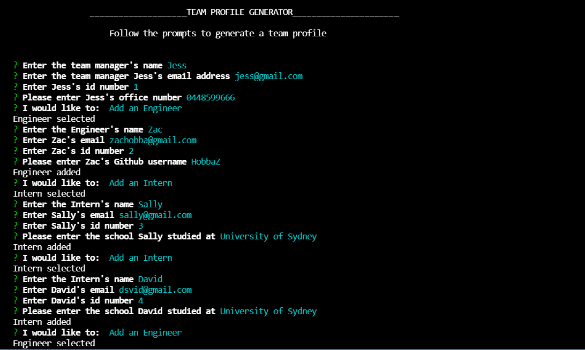

# Team-Profile-Generator

## Description
<h3>Project Aim</h3>
The aim of this project was to create a Team Profile Generator that takes input from inquirer prompts to generate a HTML page of your team members.
You can [view it here](https://github.com/HobbaZ/Team-Profile-Generator)
<h3>What Problem Does It Solve</h3>
The generator enables you to display your entered team details on a web page.
<h3>What I Learnt</h3>
in making this project, I expanded my knowledge on string literals, inquirer and validating inputs.

## Table of Contents
- [Description](#description)
- [User Story](#userstory)
- [Screenshots](#screenshots)
- [Installation](#installation)
- [Features](#features)
- [Usage](#usage)
- [Technology](#technology)
- [Contributors](#contributors)
- [Acknowledgements](#acknowledgements)
- [Testing](#testing)
- [License](#license)
- [Questions](#questions)

## User Story
GIVEN a command-line application that accepts user input

WHEN I am prompted for my team members and their information

THEN an HTML file is generated that displays a nicely formatted team roster based on user input

WHEN I click on an email address in the HTML

THEN my default email program opens and populates the TO field of the email with the address

WHEN I click on the GitHub username

THEN that GitHub profile opens in a new tab

WHEN I start the application

THEN I am prompted to enter the team manager’s name, employee ID, email address, and office number

WHEN I enter the team manager’s name, employee ID, email address, and office number

THEN I am presented with a menu with the option to add an engineer or an intern or to finish building my team

WHEN I select the engineer option

THEN I am prompted to enter the engineer’s name, ID, email, and GitHub username, and I am taken back to the menu

WHEN I select the intern option

THEN I am prompted to enter the intern’s name, ID, email, and school, and I am taken back to the menu

WHEN I decide to finish building my team

THEN I exit the application, and the HTML is generated

## Screenshots

## Installation
You will need: 
Node.js installed on your computer, npm package Inquirer to run program

1. Install Node.js on your computer
2. Clone this repo to your computer
3. Open the repo in VS Code, then open the Terminal
4. Type npm i
5. type node index.js to start the program
6. Follow the prompts

## Features
- Validators for question input
- Generate multiple pages by renaming the default index.js file
- Exit the program at any time by pressing CTRL + C
- Cool icons for various indicators

## Technology
- Node.js
- Inquirer
- CSS

## Contributors
[Zachary Hobba](https://github.com/HobbaZ)

You can also contribute by opening a pull request or submitting an issue

## Acknowledgements
[https://stackoverflow.com/questions/49520423/is-there-a-way-to-use-previous-answers-in-inquirer-when-presenting-a-prompt-inq](https://stackoverflow.com/questions/49520423/is-there-a-way-to-use-previous-answers-in-inquirer-when-presenting-a-prompt-inq)

[https://www.w3resource.com/javascript/form/email-validation.php](https://www.w3resource.com/javascript/form/email-validation.php)

[https://javascript.plainenglish.io/how-to-inquirer-js-c10a4e05ef1f](https://javascript.plainenglish.io/how-to-inquirer-js-c10a4e05ef1f)

[https://www.npmjs.com/package//inquirer](https://www.npmjs.com/package//inquirer)

[Google Fonts Lalezar](https://fonts.google.com/specimen/Lalezar?category=Display#standard-styles)

[Coolers](https://coolors.co/)

## Testing
Perform tests by running npm run test in Terminal

## License
MIT

Copyright 2021 Zachary Hobba

`Permission is hereby granted, free of charge, to any person obtaining a copy of this software and associated documentation files (the "Software"), to deal in the Software without restriction, including without limitation the rights to use, copy, modify, merge, publish, distribute, sublicense, and/or sell copies of the Software, and to permit persons to whom the Software is furnished to do so, subject to the following conditions:
The above copyright notice and this permission notice shall be included in all copies or substantial portions of the Software.
    
THE SOFTWARE IS PROVIDED "AS IS", WITHOUT WARRANTY OF ANY KIND, EXPRESS OR IMPLIED, INCLUDING BUT NOT LIMITED TO THE WARRANTIES OF MERCHANTABILITY, FITNESS FOR A PARTICULAR PURPOSE AND NONINFRINGEMENT. IN NO EVENT SHALL THE AUTHORS OR COPYRIGHT HOLDERS BE LIABLE FOR ANY CLAIM, DAMAGES OR OTHER LIABILITY, WHETHER IN AN ACTION OF CONTRACT, TORT OR OTHERWISE, ARISING FROM, OUT OF OR IN CONNECTION WITH THE SOFTWARE OR THE USE OR OTHER DEALINGS IN THE SOFTWARE.

## Questions
Find me on Github at [${answers.github}](https://github.com/HobbaZ)
Email me at [${answers.email}](zachobba@gmail.com)